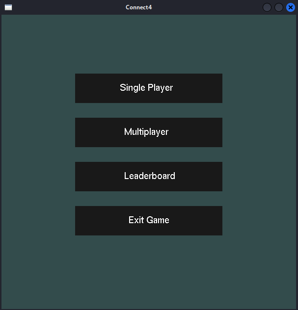

## Install necessary dependancies
```bash
sudo apt update | sudo apt install freeglut3 freeglut3-dev
```
```bash
sudo apt update | sudo apt install sqlite3
```

## Connect4

#### Menu


#### Single Player
  
Play against "Bot", spoiler : you will get destroyed.  
The bot use the minimax algorithm to calculate the best move.  
If you somehow Win, first of all congrats! Second, you can make it even harder.  
<a name="single-player"></a>
Use a text editer and change the value DEPTH in file *connectfour.cpp* at line 7 to a higher number.
```cpp
#define DEPTH 10
```
**NB**: Incrementing this digit even by only one, can have an imense impact on performance, hence it is not recommended if your PC doesn't have a lot of computational power.  

#### Multi-Player

  
Play against your friends and familly!  
Rank up in the Leaderboard.  

#### LeaderBoard
Scores are stored locally, and are retrieved from the .db file using sqlite3.  
The .db file is created upon opening the game for the first time.  
The Leaderboard display the ten players with the highest scores.  
Score = number of times a player has won against another player (real or bot player)  

## Compile the files

Simply run :
```bash
./compile_and_run.sh
```

### Single Player is unplayable
Your PC is having a hard time with all the calculations needed.
You should decrement Value DEPTH, for details on how to : [Single Player](#single-player)  
This will make the bot less challenging but will allow you to run the program without your PC exploding.
